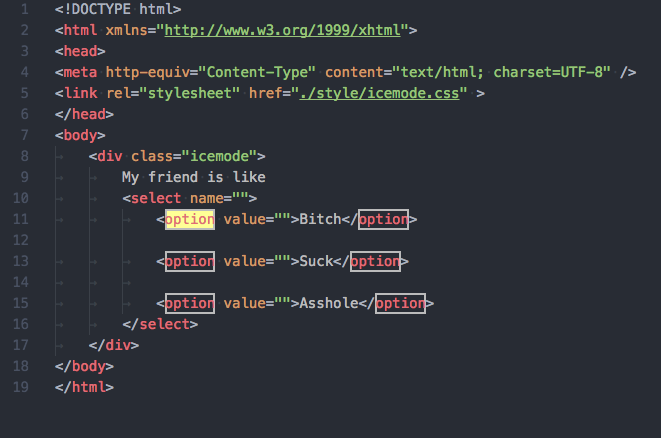

# highlight-icemode README

## Requirements
please set your setting.json. important requirements

 "workbench.colorCustomizations": {

    "editor.selectionBackground": "#FFFF96",    //選取字色 'you can set other color'

    "editor.findMatchBackground": "#FFFF96",  //搜索選取字色 'you can set other color'

    "editor.selectionHighlightBackground": "#00000000", //選取字改透明色  'required important'

    "editor.findMatchHighlightBackground": "#00000000", //搜索選取字改透明色 'required important'

    "editor.wordHighlightBackground": "#00000000",  //全文相同選取字改透明色 'required important'

    "editorBracketMatch.border": "#FF0000",   //括號的框線色 'you can set other color'

    "editorBracketMatch.background": "#0052cc"  //括號的背景色 'you can set other color'
}

## Options 
you can customized setting

"highlight-icemode.borderWidth": "2px",     //default 1px

"highlight-icemode.borderRadius": "0px",    //default 3px

"highlight-icemode.borderColor": "",        //default ''

"highlight-icemode.backgroundColor": "",    //default ''

## Known Issues

always perfect

## Future Direction

...

##############################################

**Enjoy!**